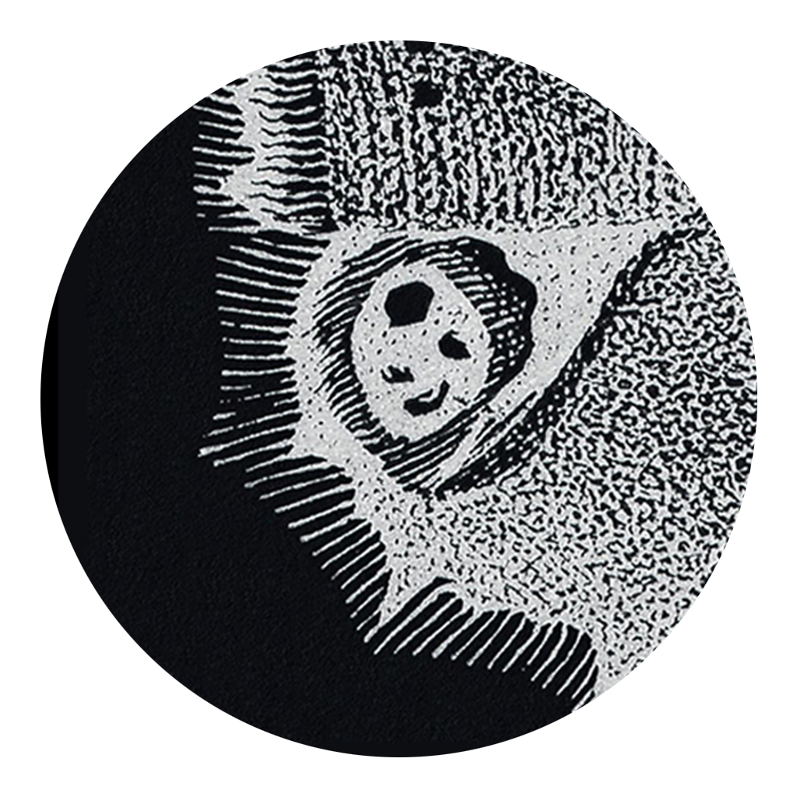
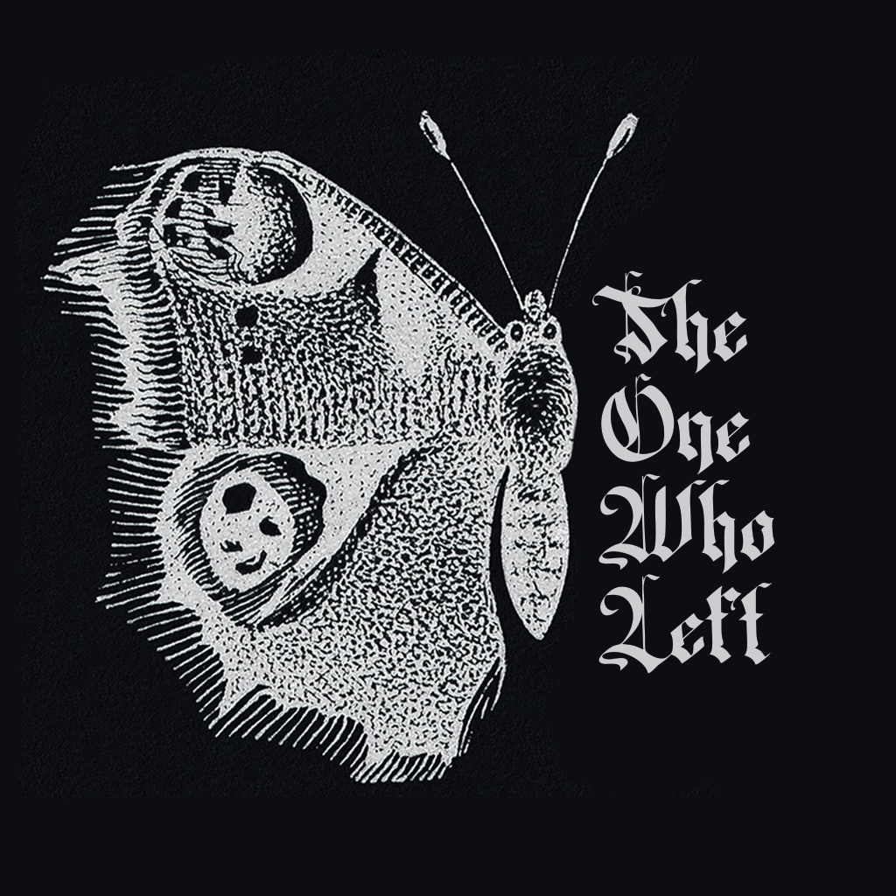

<div align="center">

<picture>
  <source media="(prefers-color-scheme: dark)" srcset="docs/branding/Logo_Banner.jpg">
  <source media="(prefers-color-scheme: light)" srcset="docs/branding/Logo_Banner-negative.jpg">
  
</picture>

<br>

### *A psychological horror experience about guilt, blindness, and the things we refuse to see.*

<br>


<br>

[Overview](#overview) &nbsp;·&nbsp; [The Journey](#the-journey) &nbsp;·&nbsp; [The God](#the-god) &nbsp;·&nbsp; [Themes](#themes) &nbsp;·&nbsp; [Development](#development)

</div>

<br>

---

## Overview

You return home from war expecting to find the life you left behind.

Instead, you find silence. The house that once meant safety has become a grave. Your wife and daughter are dead, and something else is inside: a voice, a presence, a god that has been waiting.

What begins as a search for the source of this evil becomes a journey through **guilt**, **memory**, and the consequences of the person you became.

<div align="center">

<picture>
  <source media="(prefers-color-scheme: dark)" srcset="docs/branding/Logo2-negative.png">
  <source media="(prefers-color-scheme: light)" srcset="docs/branding/Logo2.png">
  
</picture>

</div>

---

## The Story

The world was once green. The forests were alive, the fields were peaceful, everything felt untouched.

Then you returned.

The moment you step back into your home, the warmth disappears, the colors fade, and the place you once knew becomes unrecognizable. Inside, you find the bodies of your wife and daughter.

You were away fighting a war. You told yourself it was necessary. You told yourself you would return.

But while you were gone, something else arrived.

> **A cult. A voice.**
> Something they worshipped. Something that promises salvation through suffering. Something that sees everything.

The truth is more complicated than simple abandonment. You didn't leave because you stopped loving them. You left because you were **afraid**: afraid of seeing what your absence had done, afraid of admitting the person who came back was no longer the person who left.

The war didn't change you all at once. You became distant. You stopped talking. You stopped noticing the pain of the people waiting for you.

**Your body came home. But part of you never did.**

---

## The One Who Left

Nobody remembers your name. The cult doesn't know it. The dead don't speak it. Even the entity waiting at the end of your journey refuses to acknowledge it.

To them, you are not a person. You are a memory. A mistake. A wound.

<div align="center">

### *The One Who Left.*

</div>

The name isn't only about leaving your home. It marks the moment you stopped seeing the people who needed you.

---

## The Journey

<table>
<tr>
<td width="50%" valign="top">

### The House
The place where everything ended. A home corrupted by absence. The rooms remain frozen in time: a child's toy, a family photograph, a dinner table set for people who will never return.

*The house doesn't simply haunt you. It remembers you.*

</td>
<td width="50%" valign="top">

### The Forest
The world outside looks peaceful. Almost too peaceful.

The same forest that once meant life becomes the path toward something ancient. The deeper you go, the less it feels like a place and the more it feels like something **watching**.

</td>
</tr>
<tr>
<td width="50%" valign="top">

### The Mansion
A beautiful place hiding something rotten. Candles burn endlessly. Rooms are prepared for guests who never arrive. Portraits show families with missing faces.

At the center waits the person you lost.

</td>
<td width="50%" valign="top">

### The Stairway
A place that should not exist. A spiral staircase leading somewhere beyond reality, its walls and sky covered in eyes that follow your every move.

*You thought blindness meant not seeing. You were wrong.*

</td>
</tr>
</table>

<details>
<summary><b>Spoilers: the ending</b></summary>

<br>

#### The Mansion
Your wife is there, not alive, but not completely gone. She doesn't simply blame you for leaving. She wants you to understand what it felt like to love someone who was no longer truly there.

#### The Stairway
Sometimes the worst thing is being forced to see everything.

#### The Final Door
At the top of the staircase, after hearing the voice that has followed you since the beginning, a door appears. There is no room behind it. No explanation. Only darkness.

The entity mocks your journey, your pain, and your belief that destroying it will fix everything. Because the truth is worse:

> **The god was never hiding. It was always present in the things people chose not to see.**

</details>

---

## The God

Nobody knows what it truly is. The cult calls it a god. Others call it a monster. Some believe it's the punishment humanity created for itself.

It doesn't destroy worlds or conquer civilizations.

**It watches. It waits.**

It feeds on what people become when nobody is watching:

<div align="center">

`Cruelty` &nbsp; `Fear` &nbsp; `Indifference` &nbsp; `Abandonment`

</div>

---

## Themes

| Theme | The question |
|---|---|
| **Blindness** | The greatest blindness isn't the inability to see. It's seeing suffering and choosing to look away. |
| **Guilt** | Can someone forgive themselves for something they cannot forgive? |
| **Identity** | When everything is taken away, what remains? A name? A memory? A mistake? |
| **Humanity** | What happens when people stop seeing each other as human? |

---

## Inspirations

- *Blindness*, José Saramago
- Cosmic horror
- War trauma narratives
- Gothic horror
- Religious symbolism

*This is not a story about defeating evil. It's a story about confronting what happens when humanity loses sight of itself.*

---

## Screenshots

<!--
Drop screenshots into docs/screenshots/ and uncomment:

<p align="center">
  
  
</p>
<p align="center">
  
  
</p>
-->

*Coming soon.*

---

## Development

| | |
|---|---|
| **Engine** | Godot 4.x |
| **Language** | GDScript (+ a few shaders) |
| **Status** | In development |

### Run it

1. Install [Godot 4.x](https://godotengine.org/download)
2. Clone the repo
   ```bash
   git clone https://github.com/alekslime/TheOneWhoLeft.git
   ```
3. Open `project.godot` in Godot and hit **F5**

---

## Developer Note

This project explores horror beyond monsters. The most terrifying things aren't always the creatures waiting in the dark. Sometimes they're the memories we carry with us.

<br>

<div align="center">

<picture>
  <source media="(prefers-color-scheme: dark)" srcset="docs/branding/Logo1-negative.png">
  <source media="(prefers-color-scheme: light)" srcset="docs/branding/Logo1.png">
  
</picture>

<br>

> *"You were not blind because you could not see.*
> *You were blind because you chose not to look."*

</div>
